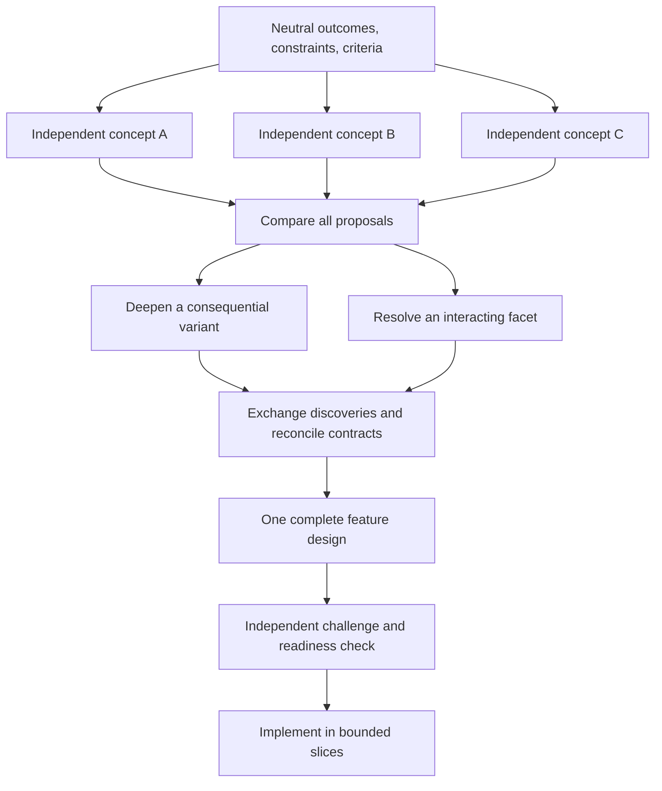

# Game development baseline

A reusable Markdown baseline for new game projects, covering playable slices, engine systems, content integration, performance, and player experience. It stays engine-agnostic and loads only the context needed for the assigned work. Project identity, facts, model bindings, tasks, and decisions are initialized only when adopted for an actual project.

Start with [setup](docs/SETUP.md). Agents start at [AGENTS.md](AGENTS.md).

## What gets loaded

```text
AGENTS.md                    Small entry point and routing
  └─ team/foundation.md      Shared engineering and collaboration contract
      ├─ one process role   Only the responsibility assigned now
      └─ assignment packet  Goal, constraints, sources, permissions, return
          └─ relevant project context and source files

Coordinator additionally reads BRIEF + WORK and the required process guides.
Game assignments receive relevant constraints from the game-development profile.
Archives, other roles, and unrelated decisions stay out of default context.
```

## Layout

| Location | Purpose | Change policy |
| --- | --- | --- |
| [AGENTS.md](AGENTS.md) | Entry point and reading routes | Baseline revision |
| [team/foundation.md](team/foundation.md) | Quality, evidence, collaboration, completion | Stable during ordinary work |
| [team/game-development.md](team/game-development.md) | Player outcomes, content ownership, game-specific validation | Versioned game profile |
| [team/design-exploration.md](team/design-exploration.md) | Independent concepts, deeper branches, comparison, and synthesis | Coordinator/designer; for new or unresolved features |
| [team/design-decomposition.md](team/design-decomposition.md) | Preserve broad design coverage and resolve bounded implementation | Coordinator/designer; activated when needed |
| `team/` process guides and [roles](team/roles/) | Workflow, dispatch, maintenance, focused responsibilities | Deliberate baseline updates |
| [team/templates/](team/templates/) | Task, handoff, design, branch proposal, decision, and area forms | Copy only when needed |
| [project/BRIEF.md](project/BRIEF.md), [MAP.md](project/MAP.md) | Project purpose, boundaries, locations, commands | Verified project facts |
| [project/WORK.md](project/WORK.md), [DECISIONS.md](project/DECISIONS.md) | Compact routing indexes | Coordinator-owned updates |
| [project/RUNTIME.md](project/RUNTIME.md) | Model aliases and observed host capabilities | Per environment |
| `project/tasks/`, `design/`, `areas/`, `decisions/`, `archive/` | Work and durable knowledge | Created on demand |
| [docs/](docs/) | Setup, design rationale, worked example | Human/reference material; not default agent input |

## How work flows

The coordinator frames the playable outcome before exploration. A fast scout gathers evidence; a fresh, strong partner challenges consequential choices without inheriting project history. Workers own narrow code or content scopes. Functional tests, measured performance, and observed player experience supply distinct evidence. The coordinator integrates results and a curator repairs stale context when triggered.

| Role | Game-development responsibility |
| --- | --- |
| [Coordinator](team/roles/coordinator.md) | Scope and integrate a playable slice with explicit acceptance |
| [Scout](team/roles/scout.md) | Trace engine code, scenes, assets, existing contracts, and checks |
| [Partner](team/roles/partner.md) | Challenge a neutral design or technical dilemma in fresh context |
| [Game designer](team/roles/game-designer.md) | Define mechanics, player outcomes, and testable design hypotheses |
| [Builder](team/roles/builder.md) | Implement gameplay and engine-system changes |
| [Content integrator](team/roles/content-integrator.md) | Integrate assigned levels, assets, animation, audio, VFX, and UI |
| [Performance analyst](team/roles/performance-analyst.md) | Measure bottlenecks under identified build/device/scenario conditions |
| [Verifier](team/roles/verifier.md) | Run functional, import, and target-build checks |
| [Playtester](team/roles/playtester.md) | Observe player flows, usability, accessibility, and feel |
| [Reviewer](team/roles/reviewer.md) | Independently inspect code/content correctness and risks |
| [Curator](team/roles/curator.md) | Repair drift in game contracts and production knowledge |

These are eleven available responsibilities. Activate only the useful ones: a tuning fix should not spawn a studio. Model tiers keep bounded exploration and mechanical checks cheap while reserving stronger reasoning for ambiguous designs and subtle failures.

Minor fixes use a short path. Resumable or delegated work gets one task directory with separate, exclusively owned handoffs. Consequential choices become decision records; completed work leaves the active index. [The worked example](docs/EXAMPLE.md) shows delegation, a design challenge, interruption recovery, and closeout.

New nontrivial features begin with independent alternatives before implementation is decomposed. Designers receive the same neutral brief without the coordinator's favored solution or other proposals. The coordinator compares the completed concepts, deepens consequential questions, exchanges useful discoveries, and assembles a coherent detailed design. A fresh reviewer challenges missing behavior and incompatible assumptions before implementation readiness.



Defaults bound exploration to three concepts, at most two shortlisted parents with two children each, and eight design assignments including the final challenge. The coordinator can adjust that budget for a specific unresolved decision. A branch artifact also serves as its handoff; builders receive accepted decisions rather than every proposal. No additional permanent roles are required.

Coverage records retain defining behavior, feedback, content differences, omissions, and later scope. Specify the whole agreed feature before design readiness, then detail coding assignments for the next playable slice. A finished slice remains an intermediate milestone until the requested scope is satisfied or explicitly revised. Clear local changes need no design record or exploration tree.

Quality and coordination cost require evaluation in actual projects. [The comparison guide](docs/TRIAL.md) explains how to compare workflow approaches and capture actionable feedback; the template itself makes no measured improvement claim.

“Automatic” means the instructions require agents to update records at milestones and before yielding. Markdown does not run a scheduler, choose a model by itself, enforce access controls, or guarantee a write after a crash. Multi-agent execution, cheaper models, and context isolation depend on host support; the framework defines explicit fallbacks. Codex-specific setup follows [official instruction-loading](https://learn.chatgpt.com/docs/agent-configuration/agents-md) and [subagent guidance](https://learn.chatgpt.com/docs/agent-configuration/subagents).

No package manager, database, orchestration service, or required scripts. Copy the baseline into a new repo and initialize the top-level project files from evidence. Choose the engine, genre, platforms, and budgets for that game; no particular game stack is imposed here.
