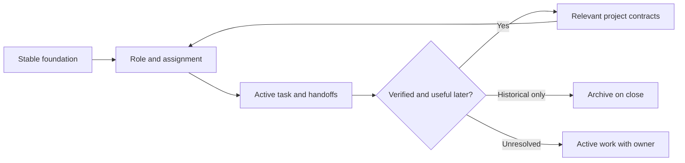

# Design notes

Foundation: 1.0.0. Game profile: 1.1.0. These are explanations for maintainers, not another layer every agent must read.

## Game-development profile

This profile specializes the seven existing processes and adds four optional roles: game designer, content integrator, performance analyst, and playtester. It keeps a single builder for gameplay and engine code; networking, rendering, AI, tools, and other disciplines become bounded assignments as needed, not a permanent agent department per topic.

The profile separates player-outcome hypotheses, implementation, asset/scene integration, measured technical evidence, and observed player experience. A successful compile cannot establish game feel; a good playtest cannot establish save compatibility or a resource budget. Packets identify only the relevant engine/build/platform, scene/input/seed, content dependencies, and acceptance evidence.

Shared scene files, imported metadata, and editor/build outputs add ownership risks. The coordinator assigns those related paths together, serializes edits, or isolates editor projects and outputs. Role boundaries do not imply that two specialists can safely edit one scene concurrently.

The game profile builds on the shared foundation, task lifecycle, and model aliases. The four specialist guides are loaded only when selected. The small-task path remains available. The profile imposes no engine, genre, multiplayer requirement, or fixed resource budget.

## Layered design experiment

Profile 1.1.0 adds optional [design decomposition](../team/design-decomposition.md) for broad game goals, interacting systems, and observed detail loss. Its aim is to preserve product intent while resolving bounded implementation assignments. This is a hypothesis about quality and coordination cost, not a measured improvement.

A compact coverage map connects player outcomes to behavior, presentation, content depth, acceptance, and evidence. Delivery scope and evidence state are separate: a verified first slice does not imply that later scope exists. Simplifications name their effect and authority. Decision layers describe experience, behavior, shared contracts, implementation, and evaluation; playable slices exercise them together.

Only the next slice and critical dependencies receive detailed specification. Workers inherit relevant decisions and parent intent, with routine choices allowed inside explicit boundaries. A stronger coordinator/designer resolves ambiguous mechanics and integration, while objective bounded work can use FAST. The protocol neither increases a model's inherent capability nor guarantees savings.

One canonical design record is created on demand and linked through existing records. No new permanent role, index, scheduler, mandatory task per layer, or initialized project data is introduced. Small local changes bypass decomposition. Existing projects can keep equivalent canonical design docs; the unchanged foundation remains compatible. [The comparison guide](TRIAL.md) covers quality, omissions, escalation, and overhead. Remove or narrow process that trials show has no useful consumer.

## Design choices

| Concern | Choice | Tradeoff |
| --- | --- | --- |
| Important rules get lost in long prompts | Small root router plus shared foundation | Requires disciplined routing and actual reads |
| Broad game goals lose defining details | Coverage IDs, bounded behavior specifications, integrated scenarios | More design work; benefit must be compared with overhead |
| Every worker inherits irrelevant history | Fresh assignment packets and one role | Coordinator must include relevant cross-cutting constraints |
| Too much work lands on the expensive model | Capability aliases with bounded FAST tasks | Savings depend on host support and escalation rates |
| The main agent anchors on its first idea | Context-isolated STRONG partner before consequential choices | Neutral framing still contains the driver's assumptions |
| Plans get written before understanding the problem | High-level framing, then targeted evidence, then decision brief | Keep the framing short; evidence may change it |
| Handoffs and logs fill the context | Current task plus one handoff per assignment attempt | Recovery still needs source inspection after a crash |
| Agents overwrite each other's work | One writer per file; serialized ownership transfer | Shared Markdown is not a distributed lock |
| Project exceptions erode common standards | Stable baseline separate from project facts | Deliberate revisions need a compatibility review |
| Maintenance becomes another backlog | Small closeout pass and bounded event-triggered curator pass | Agents must execute the instructions; no daemon guarantees it |

## Information lifetime

A fact has one canonical home: product pillars and boundaries in BRIEF, detailed intended behavior and coverage in an activated design record, locations and commands in MAP, verified subsystem contracts in area notes, consequential rationale in decision records, and current execution state in a task. Handoffs carry evidence and next actions across agent boundaries; they do not redefine product requirements. Indexes route to these records without retelling their content.

The root and foundation are shared, small inputs. The coordinator handles coordination guides and project indexes. Workers receive relevant facts and sources, not a copy of all coordinator context. The partner gets a neutral problem and the baseline contract inline, with no project-file exploration. Required platform-injected instructions still apply.

## Quality without extra architecture

The foundation asks for clear module responsibilities, explicit interfaces, readable code, real failure handling, and proportionate verification. It does not impose a folder structure, dependency-injection framework, microservices, or universal test count. Scalability means respecting actual work and resource bounds, then measuring where needed.

The pre-solution brief makes intent and validation visible. It records short conclusions, options, assumptions, and evidence, not hidden chain-of-thought. A reviewer can evaluate a choice without inheriting an entire conversation.

Roles separate processes when that separation helps. A tiny edit can remain local. A standard task might use only a scout and builder. A risky interface change benefits from a partner, verifier, and independent reviewer. Testing and review have different outputs: one supplies execution evidence, the other looks for defects and missing cases.

## Deliberate limits

This is a behavioral protocol, not an orchestration engine. It cannot guarantee compliance, schedule maintenance while nobody is running, atomically reserve files, provide real sandboxing, or persist state after an abrupt crash. Host facilities provide execution and isolation. The framework supplies useful fallbacks and requires accurate reporting of limits.

Word targets are starting heuristics, not measured token guarantees. Do not split a coherent rule across many tiny files merely to satisfy a budget. Prefer pruning duplication, linking evidence, and giving workers bounded questions. Add files or roles only when repeated work demonstrates a distinct consumer and ownership boundary.

Foundation 1.0.0 establishes the initial contract. Profile 1.1.0 adds the compatible design-decomposition experiment described above. Future revisions record their purpose and compatibility impact here, keeping historical detail in version control rather than growing the agent entry point.
